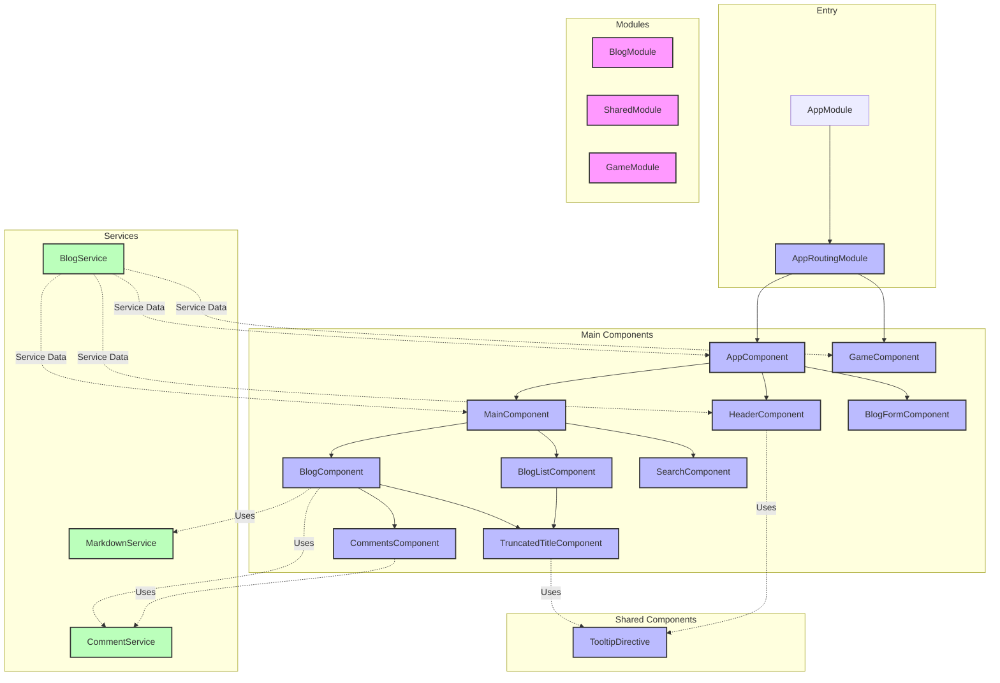

# Angular

## Introduction

**Angular** is a comprehensive framework for building web, mobile and desktop applications. 

Its significance stems from its **robust architecture and full-featured toolkit** that includes everything developers need to build scalable applications.

Angular enables developers to create **powerful components with dependency injection**, and then organize them into **modules to build enterprise-level applications**.

With its **change detection mechanism and Ivy rendering engine**, it efficiently updates and renders components when data changes, resulting in high-performance applications.

As a result, Angular has become an **enterprise-level framework**, widely adopted by **large organizations and businesses worldwide**.

[Angular Github](https://github.com/angular/angular): Star 89k, Fork 24k

- [Angular Official Site](https://angular.io/docs)

## Project Design

